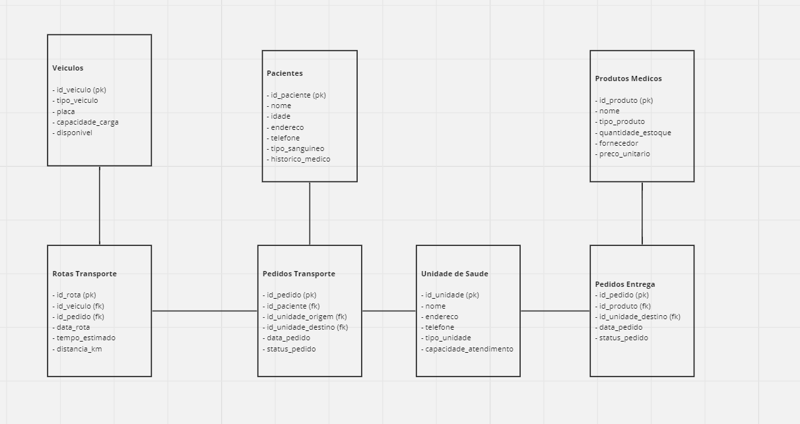
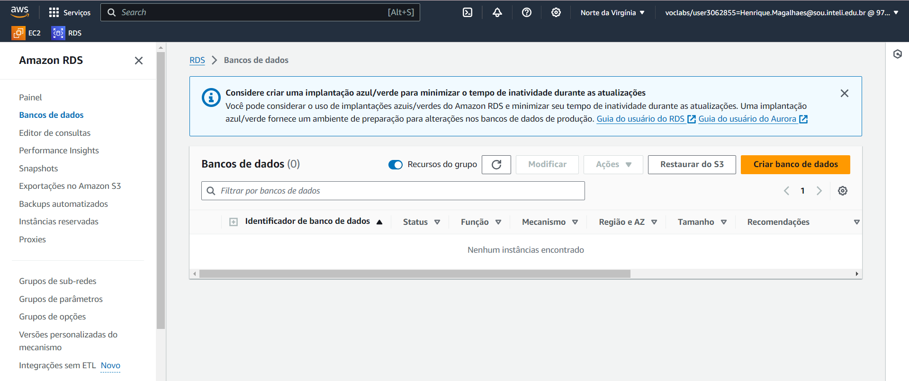
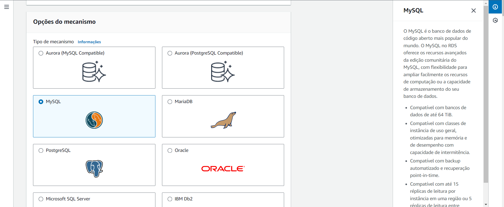
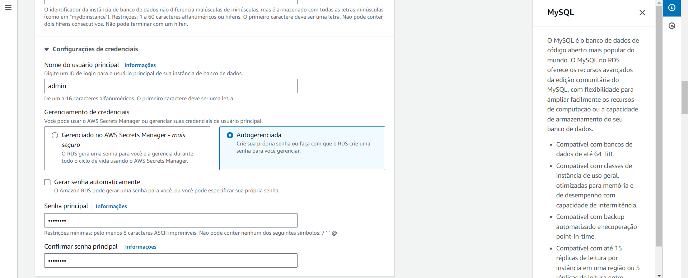
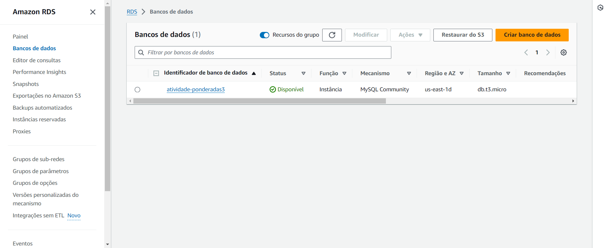
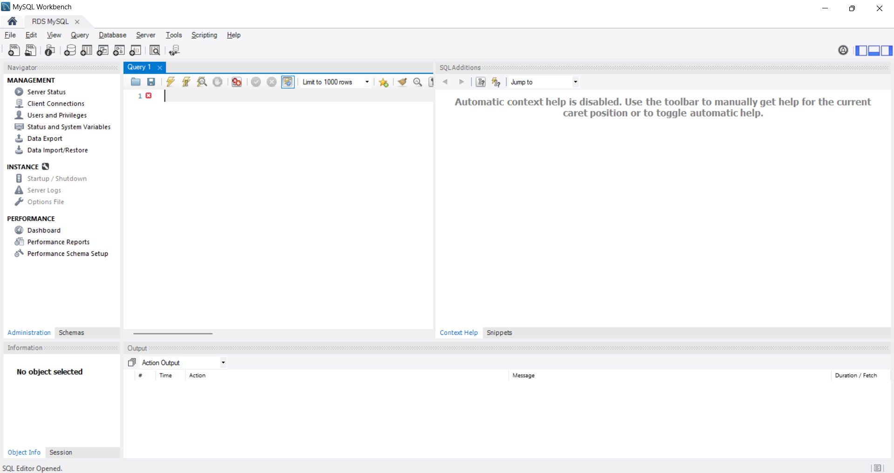
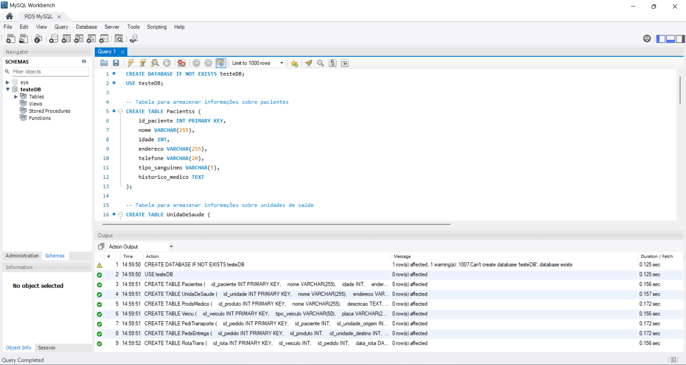
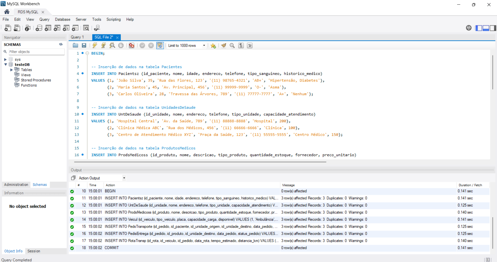
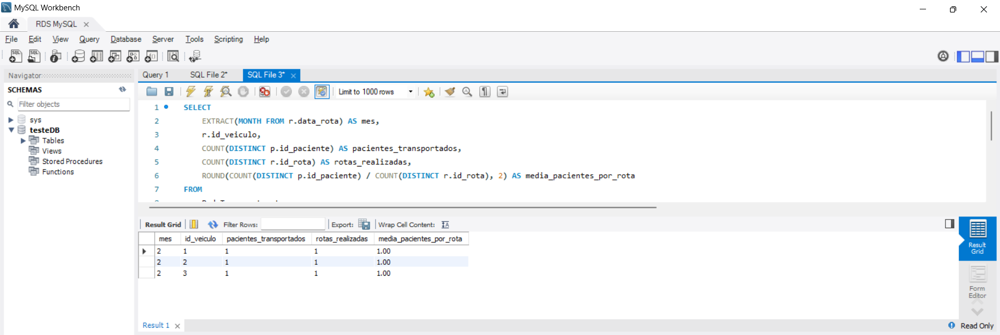

# Atividade Ponderada S03

## Descrição do Problema

Este projeto visa desenvolver um sistema de banco de dados para uma organização que busca aprimorar a prestação de serviços de transporte relacionados à saúde e à entrega de produtos médicos. O sistema precisa gerenciar eficazmente o transporte de pacientes para unidades de saúde, como hospitais, clínicas e centros de atendimento médico, enquanto simultaneamente garantindo a entrega eficiente de produtos médicos, como medicamentos, equipamentos médicos e suprimentos hospitalares.

## Objetivos do Sistema

- Gerenciar o transporte de pacientes para unidades de saúde.
- Garantir a entrega eficiente de produtos médicos.
- Acompanhar pacientes para garantir tratamento médico oportuno.
- Otimizar rotas de transporte de pacientes.
- Gerenciar frota de veículos médicos.
- Controlar estoque de produtos médicos.
- Avaliar continuamente a eficácia do sistema para melhorar o acesso a serviços de saúde e produtos médicos.

## Modelo de Entidade e Relacionamento (MER)

O modelo de entidade e relacionamento foi desenvolvido considerando as seguintes entidades principais:

1. **Pacientes:** Informações sobre os pacientes, como nome, idade, endereço, telefone, tipo sanguíneo e histórico médico.

2. **Unidades de Saúde:** Informações sobre as unidades de saúde, incluindo nome, endereço, telefone, tipo de unidade e capacidade de atendimento.

3. **Produtos Médicos:** Informações sobre os produtos médicos disponíveis, como nome, descrição, tipo, quantidade em estoque, fornecedor e preço unitário.

4. **Veículos:** Informações sobre os veículos da frota, como tipo de veículo, placa, capacidade de carga e disponibilidade.

5. **Pedidos de Transporte:** Registros de pedidos de transporte de pacientes, incluindo paciente, unidades de origem e destino, data do pedido e status.

6. **Pedidos de Entrega:** Registros de pedidos de entrega de produtos médicos, incluindo produto, unidade de destino, data do pedido e status.

7. **Rotas de Transporte:** Informações sobre as rotas de transporte otimizadas, incluindo veículo, pedido associado, data da rota, tempo estimado e distância percorrida.

## Modelo lógico

<h6> Figura 1: Criação do Modelo lógico </h6>

### Estrutura do banco de dados

- `Pacientsz`
- `UntDeSaude`
- `ProdsMedicoss`
- `Veicul`
- `PredsTransporte`
- `PedisEntrega`
- `RotaTransp`  

## Configuração do Banco de Dados no AWS RDS

### 1. Criação da Instância de Banco de Dados

<h6> Figura 2: Criação da Instância </h6>

<h6> Figura 3: Criação da Instância </h6>

<h6> Figura 4: Criação da Instância </h6>

<h6> Figura 5: Criação da Instância </h6>

### 2. Conexão com o MySQL Workbench

<h6> Figura 6: Conexão com o MySQL Workbench </h6>

<h6> Figura 7: Conexão com o MySQL Workbench </h6>

Após a conexão bem sucedida e a criação das tabelas, insere-se dados fictícios para a continuação do exercício:

<h6> Figura 8: Inserção de dados fictícios </h6>

Por fim, calcula-se o número médio de pacientes transportados por veículo por mês seguindo este exemplo abaixo

<h6> Figura 9: Inserção de dados fictícios </h6>

